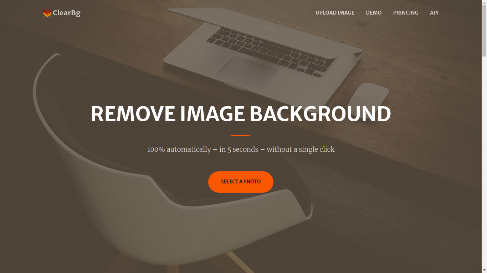
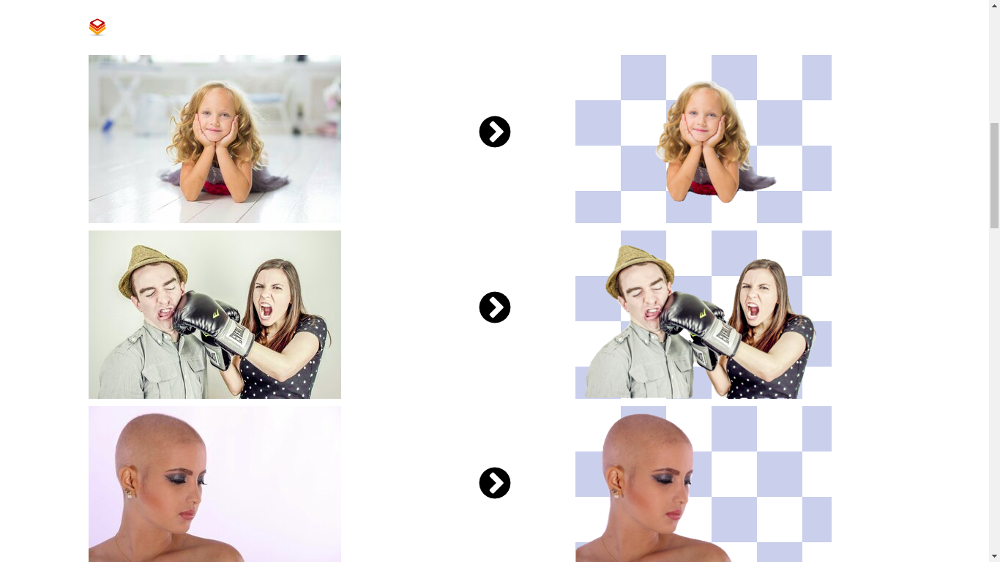
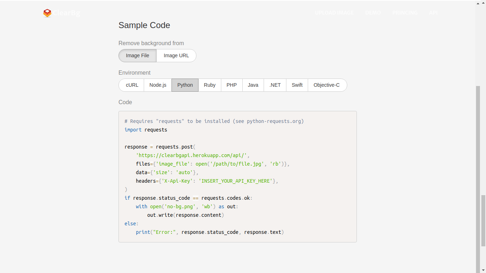

<h1> ClearBg</h1>

<h1>Objetivo</h1>

    O objetivo central desse projeto foi desenvolver uma interface que interligasse
    o usuário com a Api que retira o fundo das imagens, desenvolvida também por mim.

 
    Você pode acessar a Api <a href="https://github.com/celsolnv/clearbgapi" target="_blank">Clicando Aqui.</a>

<h1>Interface</h1>

<h1>Algumas observações</h1>

    Algumas funcionalidades ainda estão sendo desenvolvidas e o site foi escrito com 
    a lingua inglesa porque a intenção era que essa interface, juntamente com a Api fosse 
    comercializada.

    Há uma versão desta interface que já está online. Você pode acessa-lá 
    <a href="http://clearbg.orgfree.com/index.html" target="_blank"> Clicando Aqui.</a>

 